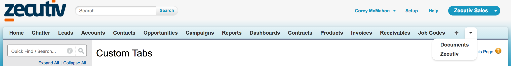
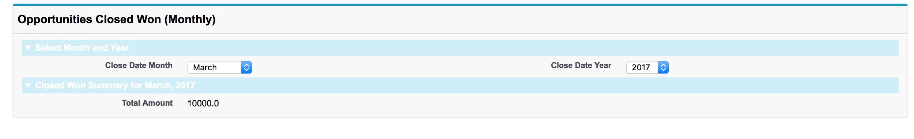
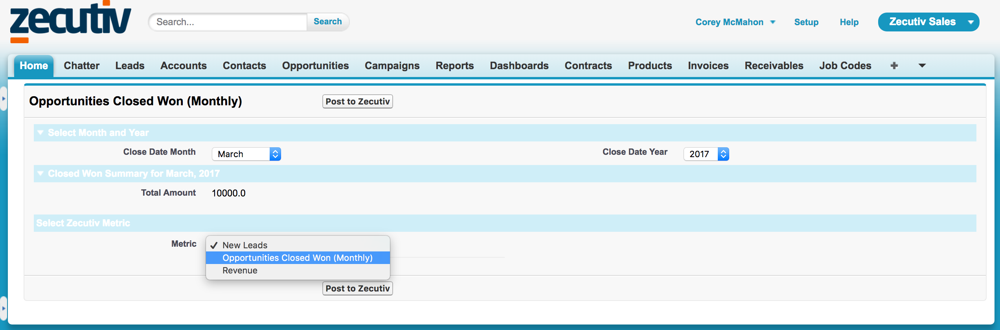
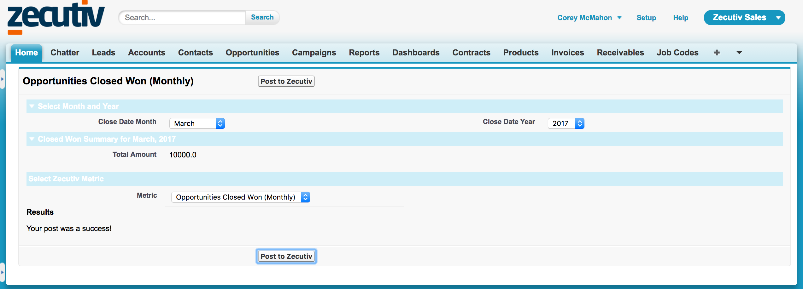

# Integrating with Zecutiv in Salesforce: A Worked Example #

As simple as Zecutiv makes it for businesses to distribute KPI reporting to relevant employees throughout their workforce, it often makes sense to integrate or automate reporting of data that lives in other systems to eliminate the work of manual entry. A common example of this is sales metrics from a CRM such as Salesforce. In this example, we will show how create entries for a metric in Zecutiv through a simple form directly in Salesforce.

Disclaimer: Unlike several members of the Zecutiv team who have years of familiarity, I have never used Salesforce before. That just goes to show how simple we have made it to integrate Zecutiv into any enterprise system.

### Contents ###

- [Our Task](#our-task)
- [Creating Our Salesforce Page](#creating-our-salesforce-page)
- [Calculating Our Entry Value](#calculating-our-entry-value)
- [Including the Zecutiv SDK](#including-the-zecutiv-sdk)
- [Making a Query to Zecutiv's GraphQL API](#making-a-query-to-zecutivs-graphql-api)
- [Submitting Our Form](#submitting-our-form)
- [Next Steps](#next-steps)


## Our Task ##

In this example, we have a metric in Zecutiv called "Opportunities Closed Won". Our Salesforce instance tracks our sales opportunities and we want to see the cumulative amount of those opportunities which closed within a single month, a useful indicator of the success of a sales team's performance. For a streamlined reporting process, we want a simple UI in Saleforce where we pick a month and a year and see the number, and send it off to the desired metric in Zecutiv.

## Creating Our Salesforce Page ##

To start, we need to create a [Visualforce page](https://trailhead.salesforce.com/en/modules/visualforce_fundamentals/units/visualforce_creating_pages) in Salesforce and an associated [Apex controller](https://developer.salesforce.com/docs/atlas.en-us.pages.meta/pages/pages_controller_custom.htm).

zIntegrateController.axpc:
```java
public with sharing class zIntegrateController {
  // properties will go here
}
```

Zecutiv_Integrate.vfp
```html
<apex:page controller="zIntegrateController" >
    <apex:form >
      <apex:pageBlock title="Opportunities Closed Won (Monthly)">
      </apex:pageBlock> 
    </apex:form>
</apex:page> 
```

We also create a Custom Tab that we can use to visit this page.



To start, we are going to create a couple dropdowns to select the month and year. This involves creating some fields on our controller and using built-in visualforce components to interact with them.


## Calculating Our Entry Value ##

The next thing we want to do is the the value we will actually send to Zecutiv for our entry. In this case, we have opportunities in Salesforce, but we need some logic to select just closed & won opportunities in the relevant time frame, and give us the sum of their amounts. This can be done in our controller and we will also update our Visualforce page to display this value for the user to see.

zIntegrateController.apxc:
```java
public Double selectedMonthSum {
    get{
        
        selectedMonthSum = (Double)groupedResult[0].get('sum') != null ? (Double)groupedResult[0].get('sum') : 0.00;
        return selectedMonthSum;
    }
    set;
}

public List<Opportunity> Opps {get; set;} 

private List<AggregateResult> groupedResult {
    get{
        groupedResult = [select Sum(Amount) sum from Opportunity where StageName='Closed Won' and CALENDAR_MONTH(CloseDate) = :Integer.valueOf(selectedMonth) and CALENDAR_YEAR(CloseDate) = :Integer.valueOf(selectedYear)]; 
        return groupedResult;
    }
    set;
}
```

This is the bulk of our work in Salesforce, and it gives us a page that looks like this:



We are now ready to integrate with Zecutiv to allow the user to select the metric they want to create entries for.

## Including the Zecutiv SDK ##

The Zecutiv API SDK is a small directory of javascript files that allow a user to authenticate with AWS Cognito, our identity provider and authentication service as well as simply make requests to Zecutiv's API with a simple function call. This bundle can be installed as a Salesforce package. [(Get in touch if you're interested in getting this package!)](https://zecutiv.com/contact/). Once installed, you will have a Visualforce snippet called `Zctv` that can be included on any Visualforce page to pull in the SDK.

Zecutiv_Integrate.vfp:
```html
 <apex:include pageName="Zctv" />
```

The Zecutiv API SDK adds a function to the global namespace called `zapiGraphQLPost` that can be used to make requests to Zecutiv. It has the following signature:

```
function zapiGraphQLPost ( graphQLString, username, password ) => responsePromise

arguments:
  -graphQLString - String -> a string representing the body of your graphql query or mutation. Details of the GraphQL langage can be found on the [GraphQL website.](http://graphql.org/) Details of Zecutiv's available GraphQL queries can be found in the [settings of your Zecutiv instance.](https://app.zecutiv.com/config/graphiql)
  -username - String -> a string with your Zecutiv username. We recommend storing this as a field on your User object.
  -password - String -> a string with your Zecutiv password. We recommend storing this as an **encrypted** text field on your User object.

returns:
  -responsePromise - JavaScript promise object -> a promise that either resolves with the HTTP response or rejects with an error.
```

**Note:** *Zecutiv compatibility with OAuth 2.0 is currently under development. Once this is completed, authentication with Zecutiv will change to use standard practices under OAuth 2.0.*

## Making a Query to Zecutiv's GraphQL API ##

In our case, the first request we want to make is a query to obtain a list of metrics in our Zecutiv instance. For this we need to write our query and obtain our user's Zecutiv username and password. I made the Zecutiv\_Username and Zecutiv\_Password fields on the User object. Because the latter should be encrypted, you must obtain in the controller, otherwise it will come through in a masked format.

zIntegrateController.apxc:
```
public String zctvPassword {
    get{
        String password = [Select Zecutiv_Password__c From User Where Id = :UserInfo.getUserId()][0].Zecutiv_Password__c;
        return password;
    }         
}
```

Now we can use the username and password in our Visualforce page to make a request. All multi-record queries in Zecutiv follow the [GraphQL Relay Specification](https://facebook.github.io/relay/docs/graphql-relay-specification.html). This means to get the name and id of every metric we have access to our query will look like this:

```javascript
var graphQLQuery = '{ metrics { edges { node { id, name } } } }';
```

We will submit this query using our username and password and then create a dropdown in the DOM.

```javascript
// Get username and password
var username = "{!$User.Zecutiv_Username__c}";
var password = "{!zctvPassword}";

zapiGraphQLPost(graphQLQuery, username, password)
.then(function(response) {
  // Success! Do what you want with the response (e.g. create a dropdown)
})
.catch(function(err) {
  // Handle error
});
```

At this point, the UI of our page is complete.



## Submitting Our Form ##

Finally we come to the task of submitting our form and writing our entry to Zecutiv. To start, let's add a function to make the request. It takes the values from our page and constructs a GraphQL query to add an entry for the metric, which will look like this:

```
var graphQLQuery = 'mutation { upsertMetricPeriodData( metricPeriodData: { metricId: "' + zctvMetricId 
+ '", periodStartDate: "' + periodStartDate + '", entryValue: ' + selectedMonthSum + ' } ) { metricId } }';
```

Lastly it inserts some HTML into the DOM if the request is successful.

This has a complication that we want to use some of the values of our zIntegrateController's properties, namely the month/year values we selected and the computed value we want for our entry. These values can be accessed the same as they can anywhere else in our Visualforce page, using the `{!propertyName}` syntax. However, those values change based on user input and without an Apex component, our function won't be passed the updated values

We can get around that by wrapping the `<button>` tag  we use to invoke our function in an apex component that we can rerender when necessary. In our month and year dropdowns, we put the value `submitButtons` in the `rerender` property of the `<apex:actionSupport>` elements with our other form inputs. This will cause our button to rerender whenever those values change, thus enabling it to pass our submit function the updated values.

Zecutiv_Integrate.vfp:
```html
<apex:outputPanel id="submitButtons">
    <button form="zctvForm" type="submit" onClick="createEntryInZecutiv({!selectedMonth}, {!selectedYear}, {!selectedMonthSum});">
        Post to Zecutiv
    </button>
</apex:outputPanel>
```

And with that, it should work! We can now submit entries for our Opportunities Closed Won metric on a monthly basis.



## Next Steps ##

This simple integration is just the start of the possibilities integrating Zecutiv with Salesforce. While we created a simple, intuitive UI for our entry, you could also automate this with a recurring job in Salesforce.

If you have interest in ditching your document-based business performance review process in favor of a Zecutiv's platform-based solution, [please reach out!](https://zecutiv.com/contact/)